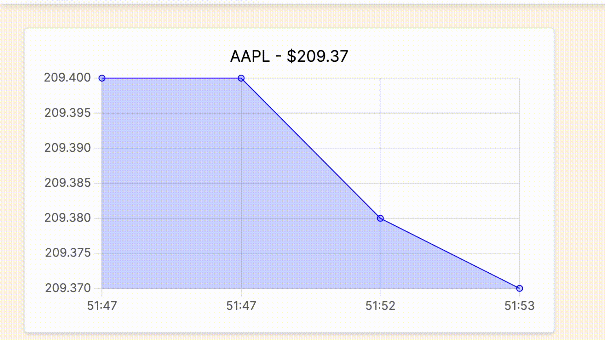

# Market Watcher

[](LICENSE)

---

Market Watcher displays real-time stock market trade charts.  
It fetches live trade data from the **Alpaca** service using their WebSocket API.




---

## Tech Stack

- **Backend:** Ruby on Rails 8
- **Database:** PostgreSQL 
- **Realtime:** Action Cable + Redis (WebSocket backend)
- **Frontend:** Hotwire (Turbo + Stimulus), Tailwind, Chart.js
- **Testing:** RSpec (Rails) and Jest (Stimulus JavaScript)
- **Containerization:** DevContainers (Docker-based development environment)

---

## Getting Started

You can run the codebase in one of the following ways:

1. **Using DevContainers (Docker-based approach)**  
   This is the recommended method. It provides a preconfigured development environment using Docker.

2. **Manual Setup**  
   If you prefer to set everything up manually, refer to the `.devcontainer` folder for a complete list of required dependencies.
 
### Setup with DevContainers

1. Install [Docker Desktop](https://www.docker.com/products/docker-desktop).
2. Open the project folder in an editor that supports DevContainers (e.g., VS Code with the DevContainers extension).

Once the container is started, it will automatically install the required dependencies, set up the environment, and seed a default user with a preconfigured trading channel.

---

## Run the Server

1. Open a terminal within the DevContainer environment in your editor.  
2. Start the Rails server:  
    ```bash
    bin/dev
    ```  
3. Access the application at [http://localhost:3000/](http://localhost:3000/).  

Use the default user credentials to log in:  
```text
Email: joe@mw.com  
Password: Mw6731566  
```  

The default user is subscribed to a trade channel for the Apple stock symbol (`AAPL`).  
**Note:** The chart will initially appear blank as it contains no data.

---

## Configure Trade Channels

Currently, there is no user interface for configuring trade channels. However, you can set them up through the console:

```ruby
User.first.trade_channels.create!(stock_symbol: 'ORCL')
```

You can find the list of supported stock symbols in `Trade::STOCK_SYMBOLS`. Additionally, you’re welcome to add any new symbols that you’d like to track.

---

## Configure Alpaca Trade Stream

To get real-time stock market updates, follow these steps:

1. Sign up at Alpaca:  
   [https://app.alpaca.markets/signup](https://app.alpaca.markets/signup)

2. Get your free API key:  
   [https://app.alpaca.markets/user/profile#manage-accounts](https://app.alpaca.markets/user/profile#manage-accounts)

3. Set up environment variables:  
   Copy the `.env.example` file to `.env` and populate the `ALPACA_API_KEY` and `ALPACA_API_SECRET` variables with your API credentials.

4. Rebuild the development containers to apply your changes. You can do this by selecting `Dev Containers: Rebuild Container` from the Command Palette.

5. Open a terminal within the DevContainer environment in your editor.

6. Verify environment variables are loaded correctly:  
    ```bash
    echo $ALPACA_API_KEY
    echo $ALPACA_API_SECRET
    ```

7. Start the Alpaca trade stream:  
    ```bash
    bin/rails "alpaca:trade_stream"
    ```

The charts are updated during regular trading hours, which are:

**9:30 AM to 4:00 PM, Monday to Friday**

The index is closed for trading on various U.S. holidays, including President's Day, Martin Luther King Jr. Day, Labor Day, Thanksgiving, and Christmas.

For more information, visit: [NASDAQ Opening and Closing Times](https://www.ig.com/en/trading-strategies/nasdaq-opening-and-closing-times--when-can-you-trade--230527)

### Sandbox Environment

To start the Alpaca trade stream in the sandbox environment, run the following command:

```bash
bin/rails "alpaca:trade_stream[sandbox]"
```

This will retrieve simulated trade data for the symbol `FAKEPACA`.

---

## Running Tests

You can run both backend and frontend tests.

### Rails tests (RSpec)

```bash
bundle exec rspec
```

### Stimulus JavaScript tests (Jest)

```bash
npm test
```

---

## Development Notes

To keep the codebase clean and consistent, please follow these formatting guidelines:

- **Ruby code:**  
  Format and lint Ruby files using RuboCop:
  ```bash
  bundle exec rubocop -A
  ```

- **JavaScript code:**  
  Format Stimulus and JavaScript files:
  ```bash
  npm run format
  ```

Please run these before opening a pull request or committing significant changes.

---

## Reference

- [Alpaca's Real-time Stock Data](https://docs.alpaca.markets/docs/real-time-stock-pricing-data)
- [The difference between IEX and SIP data](https://docs.alpaca.markets/docs/market-data-faq#whats-the-difference-between-iex-and-sip-data)

---

## License

This project is licensed under the MIT License – see the [LICENSE](LICENSE) file for details.
